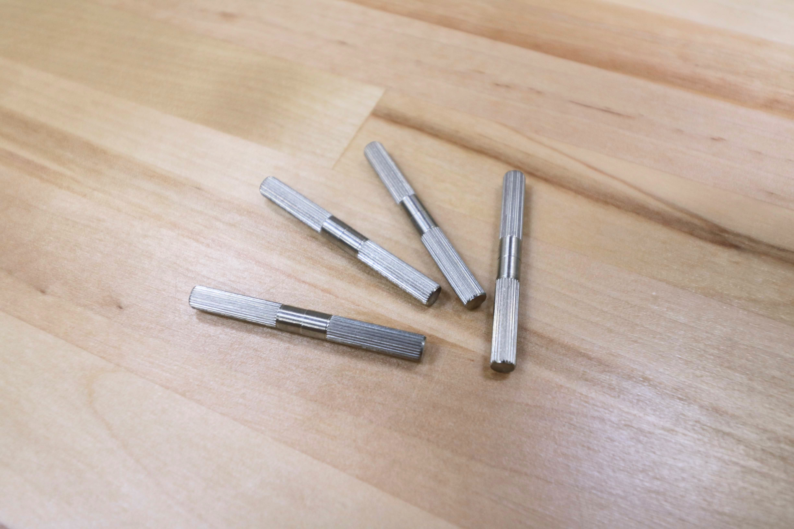

* toc
{:toc}

# Dowel Pins

These pins are used to help align track extrusions and the gantry main beams.



|                              |                              |
|------------------------------|------------------------------|
|**Material**                  |Stainless steel
|**Length**                    |40mm
|**Diameter 1**                |4.2mm
|**Diameter 2**                |4.25mm
|**Price**                     |$2.00
|**Quantity**                  |Genesis: 6 or 0 (see note above) Genesis XL: 20 or 0 (see note above)

|                              |                              |
|------------------------------|------------------------------|
|**Internal Part Name**        |`Dowel Pins`
|**Vendor**                    |LDO
|**$/pc**                      |$0.50
|**Notes**                     |
{:.internal}


