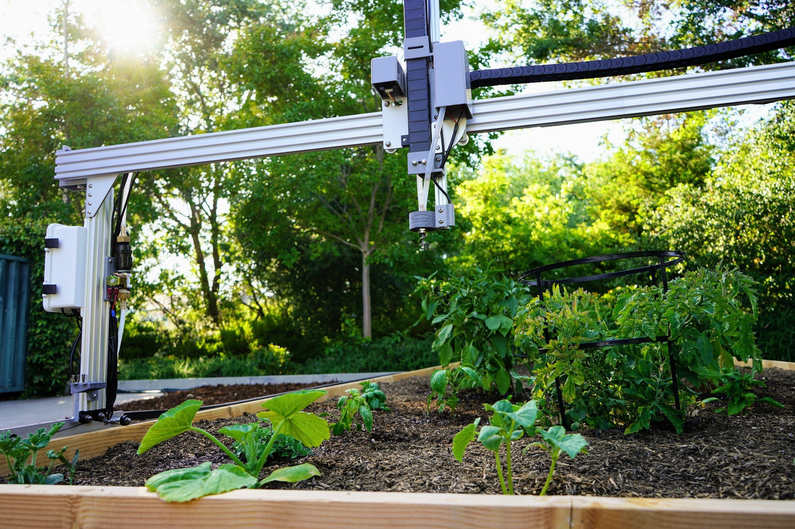
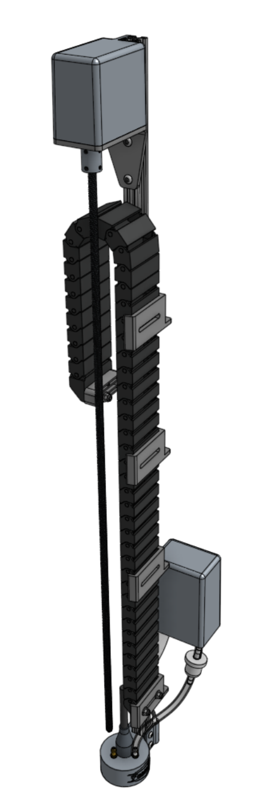
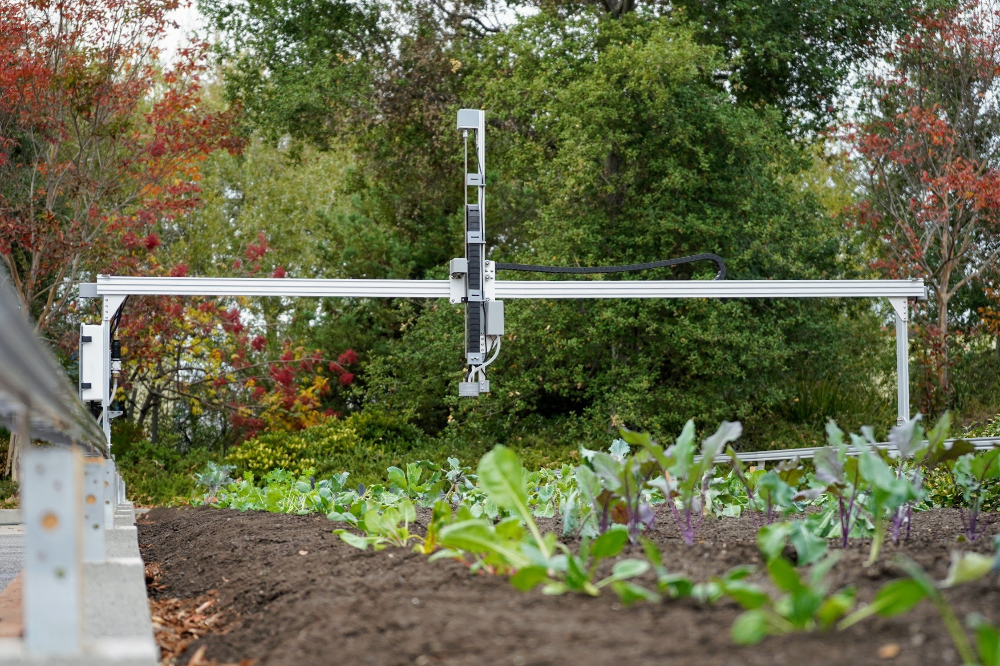
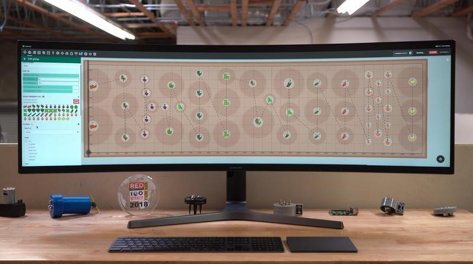
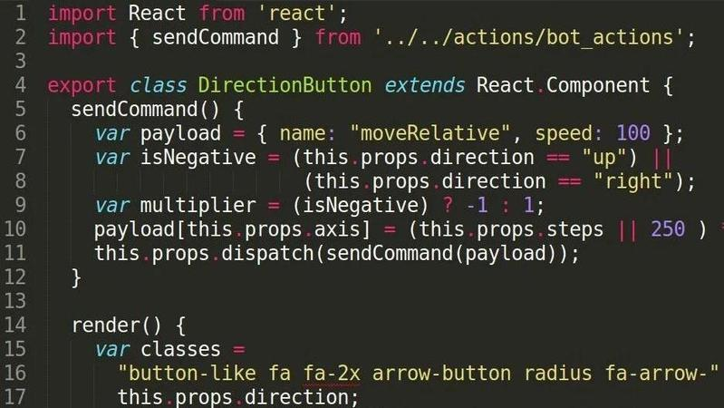
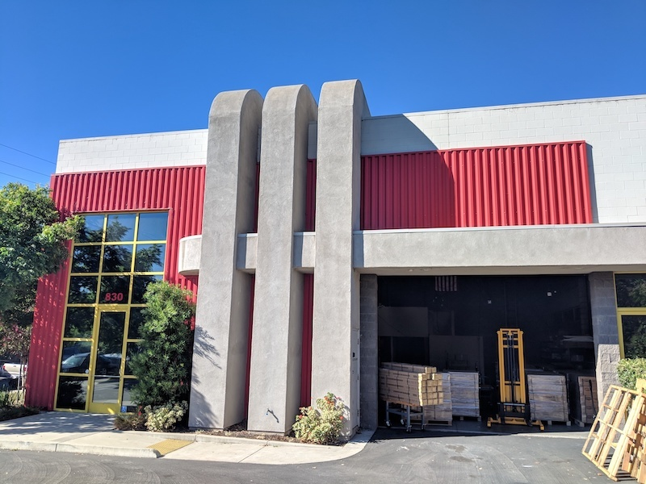



# H1 heading

## H2 heading that is much longer than the average heading such that it will wrap to additional lines

## H2 heading with emoji :robot: :seedling: :strawberry:

### H3 heading

Note that H3 headings and deeper will not show up in the table of contents.

# Tables

|Table  |    |
|-------|----|
|Content|Text

Text

|Component|$/Unit|Genesis Qty|Genesis Subtotal|(XL) Qty|(XL) Subtotal|
|---------|------|-----------|----------------|------|-----------|
|40mm Horizontal Cable Carrier Support|$3.00|12|$36.00|24|$72.00
|60mm Horizontal Cable Carrier Support|$3.00|6|$18.00|12|$36.00

|                              |                              |
|------------------------------|------------------------------|
|**Material**                  |Gray UV stabilized ABS
|**Price**                     |$3.00
|**Quantity**                  |Genesis - 12<br>Genesis (XL) - 24
|**Recommended Supplier**      |[The FarmBot Shop](http://shop.farm.bot)

|||
|---|---|
|headerless|table

# Callouts


```

```


`title` and `content` are optional. `"` characters within `title` or `content` must be escaped
(for example, `content="This is \"content\"."`).

`type` can be one of:

 * `info` (blue :information_source:)
 * `success` (green :heavy_check_mark:)
 * `warning` (orange :warning:)
 * `danger` (red :exclamation:)
 * Any slug of a [Font Awesome v4.7 icon](https://fontawesome.com/v4.7/icons/) without the `fa-` (eg: `rocket`)















# Media

## Videos


```

```




## Images

```

```


Tall images respect a maximum height:



## Galleries


```

```


{% include gallery.html images='







<iframe width="100%" src="https://www.youtube.com/embed/qwSbWy_1f8w" frameborder="0" allow="accelerometer; autoplay; clipboard-write; encrypted-media; gyroscope; picture-in-picture" allowfullscreen title="FarmBot YouTube video"></iframe>
' %}

Embeds can be added to galleries:


```

```




## Section images

Section links to aggregate BOM pages with sections for multiple parts (Genesis v1.5- and Express v1.0) have a hover image, like for these [dowel pins](../bom/legacy-parts.md#dowel-pins).

## Hover images

Links to individual part BOM pages (Genesis v1.6+ and Express v1.1+) have a hover image, like for this singular [[stepper motor]] or these plural [[stepper motors]].

# Links

```
[link](page.md)
```

Here is a [link](page.md)

## Part links

Here is a link to the BOM page for a single [[horizontal motor housing]] as well as plural [[horizontal motor housings]]. Links like this can also work with hyphenated part names and various capitalizations such as [[Z-axis motor mount]], [[Z-Axis Motor Mount]], [[ UTM ]] and [[ LED indicator wiring harness ]].

These links are created by wrapping the part name in double square brackets, `[``[`like this`]``]`, but without any spaces between the double brackets. This syntax will auto generate the link to the BOM page, extra styling, and hover image.

Other parts: [[Eccentric spacers]], [[standard spacers]], and [[M5 x 16mm Screws]]. This [[left gantry corner bracket]] has a tall aspect ratio hover image.

## CAD


```

```


Here is a link to a CAD model: 

## OER standard reference


```

```








# Misc Markdown

> block quote

horizontal rule:

---

0. list item 1
   0. sublist item
0. list item 2

* bullet list item

`code`

```
code block
```

```
code block with really long lines.

This line has a long word without whitespace. https://cdn.shopify.com/s/files/1/2040/0289/files/FarmBot.io_Trimmed_Logo_Gray_on_Transparent_1_1ec606e9-8aed-4af9-ad98-3b14a2fc0602_436x200.png?v=1588622523

2 plants marked for removal. Plants at the following machine coordinates ( X Y ) with R = radius are to be removed:
    (   743   541 ) R = 6
    (   654   447 ) R = 6

2 plants marked for safe removal. Plants at the following machine coordinates ( X Y ) with R = radius were too close to the known plant to remove completely:
    (   651   446 ) R = 7
    (   676   512 ) R = 3
```

# HTML

In addition to markdown, HTML is also supported. However, markdown nested within HTML will be rendered as plain text.

```
<details>
<summary>Details summary (click me to see more)</summary>
Here are more details
</details>
```

<details>
<summary>Details summary (click me to see more)</summary>
Here are more details
</details>

# Styles

## Buttons

```
<span class="fb-button fb-green">Button</span>
<span class="fb-button fb-purple">purple</span>
<span class="fb-button fb-red">red</span>
<span class="fb-button fb-yellow">yellow</span>
<span class="fb-button fb-gray">gray</span>
<span class="fb-button fb-orange">orange</span>
<span class="fb-button fb-teal">teal</span>
<span class="fb-button fb-blue">blue</span>
<span class="fb-button fb-clear">clear</span>
<span class="fb-button fb-add-variable">add variable</span>
```

<span class="fb-button fb-green">BUTTON</span>
<span class="fb-button fb-purple">purple</span>
<span class="fb-button fb-red">red</span>
<span class="fb-button fb-yellow">yellow</span>
<span class="fb-button fb-gray">gray</span>
<span class="fb-button fb-orange">orange</span>
<span class="fb-button fb-teal">teal</span>
<span class="fb-button fb-blue">blue</span>
<span class="fb-button fb-clear">clear</span>
<span class="fb-button fb-add-variable">add variable</span>

### Plus buttons

```
<span class="fb-circle-button fb-green"><i class='fa fa-plus'></i></span>
<span class="fb-add-command-button"><i class='fa fa-plus'></i></span>
```

<span class="fb-circle-button fb-green"><i class='fa fa-plus'></i></span>
<span class="fb-add-command-button"><i class='fa fa-plus'></i></span>

### Arrow buttons

```
<span class="fb-button fb-gray"><i class='fa fa-arrow-left'></i></span>
<span class="fb-button fb-gray"><i class='fa fa-arrow-right'></i></span>
<span class="fb-button fb-gray"><i class='fa fa-arrow-up'></i></span>
<span class="fb-button fb-gray"><i class='fa fa-arrow-down'></i></span>
```

<span class="fb-button fb-gray"><i class='fa fa-arrow-left'></i></span>
<span class="fb-button fb-gray"><i class='fa fa-arrow-right'></i></span>
<span class="fb-button fb-gray"><i class='fa fa-arrow-up'></i></span>
<span class="fb-button fb-gray"><i class='fa fa-arrow-down'></i></span>

## Inputs

```
<span class="fb-input">Input</span>
<span class="fb-input fb-disabled-input">Disabled</span>
<span class="fb-dropdown">Dropdown <i class='fa fa-caret-down'></i></span>
```

<span class="fb-input">Input</span>
<span class="fb-input fb-disabled-input">Disabled</span>
<span class="fb-dropdown">Dropdown <i class='fa fa-caret-down'></i></span>

## Peripheral controls

```
<span class="fb-peripheral-on">ON</span>
<span class="fb-peripheral-off">OFF</span>
<span class="fb-peripheral-unknown"></span>
<span class="fb-peripheral-unknown fb-peripheral-disabled"></span>
```

<span class="fb-peripheral-on">ON</span>
<span class="fb-peripheral-off">OFF</span>
<span class="fb-peripheral-unknown"></span>
<span class="fb-peripheral-unknown fb-peripheral-disabled"></span>

## Sequence commands

```
<span class="fb-step fb-move">MOVE</span>
<span class="fb-step fb-move-absolute">MOVE TO</span>
<span class="fb-step fb-move-relative">MOVE RELATIVE</span>
<span class="fb-step fb-write-pin">CONTROL PERIPHERAL</span>
<span class="fb-step fb-write-pin">TOGGLE PERIPHERAL</span>
<span class="fb-step fb-read-pin">READ SENSOR</span>
<span class="fb-step fb-set-servo-angle">CONTROL SERVO</span>
<span class="fb-step fb-wait">WAIT</span>
<span class="fb-step fb-send-message">SEND MESSAGE</span>
<span class="fb-step fb-reboot">REBOOT</span>
<span class="fb-step fb-shutdown">SHUTDOWN</span>
<span class="fb-step fb-e-stop">E-STOP</span>
<span class="fb-step fb-find-home">FIND HOME</span>
<span class="fb-step fb-set-zero">SET HOME</span>
<span class="fb-step fb-calibrate">FIND AXIS LENGTH</span>
<span class="fb-step fb-if-statement">IF STATEMENT</span>
<span class="fb-step fb-execute">EXECUTE</span>
<span class="fb-step fb-run-farmware">RUN FARMWARE</span>
<span class="fb-step fb-run-farmware">DETECT WEEDS</span>
<span class="fb-step fb-take-photo">TAKE PHOTO</span>
<span class="fb-step fb-assertion">ASSERTION</span>
<span class="fb-step fb-lua">LUA</span>
<span class="fb-step fb-mark-as">MARK AS</span>
```

<span class="fb-step fb-move">MOVE</span>
<span class="fb-step fb-move-absolute">MOVE TO</span>
<span class="fb-step fb-move-relative">MOVE RELATIVE</span>
<span class="fb-step fb-write-pin">CONTROL PERIPHERAL</span>
<span class="fb-step fb-write-pin">TOGGLE PERIPHERAL</span>
<span class="fb-step fb-read-pin">READ SENSOR</span>
<span class="fb-step fb-set-servo-angle">CONTROL SERVO</span>
<span class="fb-step fb-wait">WAIT</span>
<span class="fb-step fb-send-message">SEND MESSAGE</span>
<span class="fb-step fb-reboot">REBOOT</span>
<span class="fb-step fb-shutdown">SHUTDOWN</span>
<span class="fb-step fb-e-stop">E-STOP</span>
<span class="fb-step fb-find-home">FIND HOME</span>
<span class="fb-step fb-set-zero">SET HOME</span>
<span class="fb-step fb-calibrate">FIND AXIS LENGTH</span>
<span class="fb-step fb-if-statement">IF STATEMENT</span>
<span class="fb-step fb-execute">EXECUTE</span>
<span class="fb-step fb-run-farmware">RUN FARMWARE</span>
<span class="fb-step fb-run-farmware">DETECT WEEDS</span>
<span class="fb-step fb-take-photo">TAKE PHOTO</span>
<span class="fb-step fb-assertion">ASSERTION</span>
<span class="fb-step fb-lua">LUA</span>
<span class="fb-step fb-mark-as">MARK AS</span>

## Cable colors

```
<span class="cable-color red">red</span>
<span class="cable-color yellow">yellow</span>
<span class="cable-color green">green</span>
<span class="cable-color black">black</span>
<span class="cable-color white">white</span>
<span class="cable-color brown">brown</span>
<span class="cable-color blue">blue</span>
<span class="cable-color grey">grey</span>
<span class="cable-color orange">orange</span>
<span class="cable-color purple">purple</span>
<span class="cable-color pink">pink</span>
<span class="cable-color cyan">cyan</span>
```

<span class="cable-color red">red</span>
<span class="cable-color yellow">yellow</span>
<span class="cable-color green">green</span>
<span class="cable-color black">black</span>
<span class="cable-color white">white</span>
<span class="cable-color brown">brown</span>
<span class="cable-color blue">blue</span>
<span class="cable-color grey">grey</span>
<span class="cable-color orange">orange</span>
<span class="cable-color purple">purple</span>
<span class="cable-color pink">pink</span>
<span class="cable-color cyan">cyan</span>

# Icons and emoji

|Icon       |Meaning             |Source|
|:---------:|--------------------|------|
|(fb)       |Favicon             |`( fb )` without spaces
|(products) |Open products       |`( products )` without spaces
|(business) |Open business       |`( business )` without spaces
|(community)|1% for the community|`( community )` without spaces
|(people)   |Be good people      |`( people )` without spaces
|(?)        |Tooltip             |`( ? )` without spaces
|(XL)       |XL Sticker          |`( XL )` without spaces
|(cog)      |Settings            |`( cog )` without spaces
|:art:      |Art emoji           |`:art:`

This is a tooltip (?) inline with other text, followed by more text and other icons. And here is an (XL) sticker. And this is a value icon (community) for community. How do they look? (fb)

### LEDs

```
<span class="fa fa-circle led green"></span>
<span class="fa fa-sun-o led green"></span>
<span class="fa fa-circle-thin led green"></span>
<span class="fa fa-circle led orange"></span>
<span class="fa fa-sun-o led orange"></span>
<span class="fa fa-circle-thin led orange"></span>
<span class="fa fa-circle led red"></span>
<span class="fa fa-sun-o led red"></span>
<span class="fa fa-circle-thin led red"></span>
<span class="fa fa-circle led blue"></span>
<span class="fa fa-sun-o led blue"></span>
<span class="fa fa-circle-thin led blue"></span>
<span class="fa fa-circle led gray"></span>
<span class="fa fa-sun-o led gray"></span>
<span class="fa fa-circle-thin led gray"></span>
```

<span class="fa fa-circle led green"></span>
<span class="fa fa-sun-o led green"></span>
<span class="fa fa-circle-thin led green"></span>
<span class="fa fa-circle led orange"></span>
<span class="fa fa-sun-o led orange"></span>
<span class="fa fa-circle-thin led orange"></span>
<span class="fa fa-circle led red"></span>
<span class="fa fa-sun-o led red"></span>
<span class="fa fa-circle-thin led red"></span>
<span class="fa fa-circle led blue"></span>
<span class="fa fa-sun-o led blue"></span>
<span class="fa fa-circle-thin led blue"></span>
<span class="fa fa-circle led gray"></span>
<span class="fa fa-sun-o led gray"></span>
<span class="fa fa-circle-thin led gray"></span>

### Indicators

```
<span class="fa fa-circle saucer blue"></span>
<span class="fa fa-circle saucer green"></span>
<span class="fa fa-circle saucer red"></span>
<span class="fa fa-circle saucer gray"></span>
<span class="fa fa-circle saucer light-blue"></span>
<span class="fa fa-circle saucer yellow"></span>
```

<span class="fa fa-circle saucer blue"></span>
<span class="fa fa-circle saucer green"></span>
<span class="fa fa-circle saucer red"></span>
<span class="fa fa-circle saucer gray"></span>
<span class="fa fa-circle saucer light-blue"></span>
<span class="fa fa-circle saucer yellow"></span>

# What you can grow graphic


```

```




# What's next?

 * [Documentation Style Guide](documentation-style-guide.md)
 * [Documentation Development](development.md)
