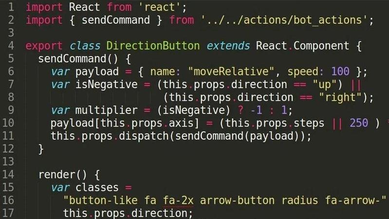
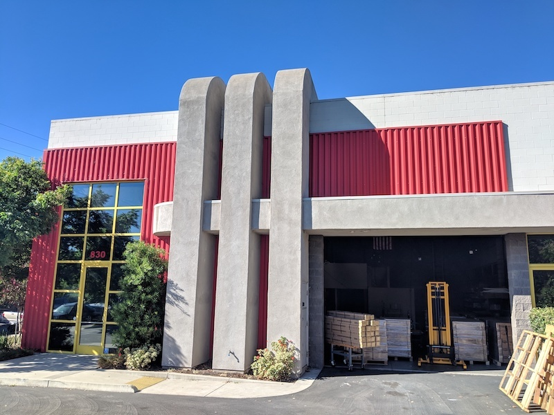

* toc
{:toc}

# H1 heading

## H2 heading

### H3 heading

Text

# Tables

|Table||
|---|---|
|content|text

Text

|||
|---|---|
|headerless|table

# Callouts













# Media

## Videos

<iframe width="100%" height="450" src="https://www.youtube.com/embed/qwSbWy_1f8w" frameborder="0" allow="accelerometer; autoplay; clipboard-write; encrypted-media; gyroscope; picture-in-picture" allowfullscreen></iframe>

## Images


Tall images respect a maximum height:


## Hover images

Links to BOM entries have a hover image, like this [horizontal motor housing](../../other/bom/parts/md#part-1).

## Galleries

{% include gallery.html images='






<iframe width="100%" height="450" src="https://www.youtube.com/embed/qwSbWy_1f8w" frameborder="0" allow="accelerometer; autoplay; clipboard-write; encrypted-media; gyroscope; picture-in-picture" allowfullscreen></iframe>
' %}

# Links

Here is a [link](page.md)

# Misc Markdown

> block quote

horizontal rule:

---

0. list item 1
   0. sublist item
0. list item 2

* bullet list item

`code`

```
code block
```

# HTML

<details>
<summary>Details summary</summary>
details
</details>

# Styles

## Buttons

<span class="fb-button fb-green">BUTTON</span>
<span class="fb-button fb-purple">purple</span>
<span class="fb-button fb-red">red</span>
<span class="fb-button fb-yellow">yellow</span>
<span class="fb-button fb-gray">gray</span>
<span class="fb-button fb-orange">orange</span>
<span class="fb-button fb-teal">teal</span>
<span class="fb-button fb-blue">blue</span>

<span class="fb-circle-button fb-green">+</span>

<span class="fb-button fb-gray"><i class='fa fa-arrow-left'></i></span>
<span class="fb-button fb-gray"><i class='fa fa-arrow-right'></i></span>
<span class="fb-button fb-gray"><i class='fa fa-arrow-up'></i></span>
<span class="fb-button fb-gray"><i class='fa fa-arrow-down'></i></span>

## Inputs

<span class="fb-input">INPUT</span>
<span class="fb-input fb-disabled-input">disabled</span>
<span class="fb-dropdown">dropdown <i class='fa fa-caret-down'></i></span>

## Peripheral controls

<span class="fb-peripheral-on">ON</span>
<span class="fb-peripheral-off">OFF</span>
<span class="fb-peripheral-unknown"></span>
<span class="fb-peripheral-unknown fb-peripheral-disabled"></span>

## Sequence commands

<span class="fb-step fb-move">MOVE</span>
<span class="fb-step fb-move-absolute">MOVE TO</span>
<span class="fb-step fb-move-relative">MOVE RELATIVE</span>
<span class="fb-step fb-write-pin">CONTROL PERIPHERAL</span>
<span class="fb-step fb-write-pin">TOGGLE PERIPHERAL</span>
<span class="fb-step fb-read-pin">READ SENSOR</span>
<span class="fb-step fb-set-servo-angle">CONTROL SERVO</span>
<span class="fb-step fb-wait">WAIT</span>
<span class="fb-step fb-send-message">SEND MESSAGE</span>
<span class="fb-step fb-reboot">REBOOT</span>
<span class="fb-step fb-shutdown">SHUTDOWN</span>
<span class="fb-step fb-e-stop">E-STOP</span>
<span class="fb-step fb-find-home">FIND HOME</span>
<span class="fb-step fb-set-zero">SET HOME</span>
<span class="fb-step fb-calibrate">FIND AXIS LENGTH</span>
<span class="fb-step fb-if-statement">IF STATEMENT</span>
<span class="fb-step fb-execute">EXECUTE SEQUENCE</span>
<span class="fb-step fb-run-farmware">RUN FARMWARE</span>
<span class="fb-step fb-run-farmware">DETECT WEEDS</span>
<span class="fb-step fb-take-photo">TAKE PHOTO</span>
<span class="fb-step fb-assertion">ASSERTION</span>
<span class="fb-step fb-mark-as">MARK AS</span>

## Cable colors

<span class="cable-color red">red</span>
<span class="cable-color yellow">yellow</span>
<span class="cable-color green">green</span>
<span class="cable-color black">black</span>
<span class="cable-color white">white</span>
<span class="cable-color brown">brown</span>
<span class="cable-color blue">blue</span>
<span class="cable-color grey">grey</span>
<span class="cable-color orange">orange</span>
<span class="cable-color purple">purple</span>
<span class="cable-color pink">pink</span>
<span class="cable-color cyan">cyan</span>

# Icons and emoji

Favicon: <span class="value-icon fb"></span>

Open products: <span class="value-icon products"></span>

Open business: <span class="value-icon business"></span>

1% for the community: <span class="value-icon community"></span>

Be good people: <span class="value-icon good-people"></span>

Tooltip: <span class="fb-tooltip"><i class='fa fa-question'></i></span>

XL sticker: <span class="fb-xl-sticker">XL</span>

Settings:
<i class='fa fa-cog'></i>

Art:
:art:

LEDs:
<span class="fa fa-circle led green"></span>
<span class="fa fa-sun-o led green"></span>
<span class="fa fa-circle-thin led green"></span>
<span class="fa fa-circle led orange"></span>
<span class="fa fa-sun-o led orange"></span>
<span class="fa fa-circle-thin led orange"></span>
<span class="fa fa-circle led red"></span>
<span class="fa fa-sun-o led red"></span>
<span class="fa fa-circle-thin led red"></span>
<span class="fa fa-circle led blue"></span>
<span class="fa fa-sun-o led blue"></span>
<span class="fa fa-circle-thin led blue"></span>
<span class="fa fa-circle led gray"></span>
<span class="fa fa-sun-o led gray"></span>
<span class="fa fa-circle-thin led gray"></span>

Indicators:
<span class="fa fa-circle saucer blue"></span>
<span class="fa fa-circle saucer green"></span>
<span class="fa fa-circle saucer red"></span>
<span class="fa fa-circle saucer gray"></span>
<span class="fa fa-circle saucer light-blue"></span>
<span class="fa fa-circle saucer yellow"></span>

# What's next?

 * [Page](page.md)
 * [Other Page](../other-page.md)
