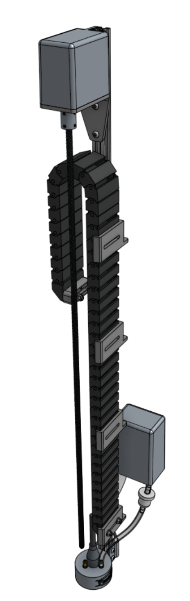

* toc
{:toc}

# Heading

content

## Tables

|Table||
|---|---|
|content|text

text

|||
|---|---|
|headerless|table

## Callouts






## Images

tall image:

[bom link with hover image](../../other/bom/parts/md#part-1)

## Galleries



## Links

here is a [link](page.md)

## HTML

Details summary

details

# Styles

### Buttons and input

buttons:
BUTTON
purple
red
yellow
gray
orange
teal
blue

+

<i class='fa fa-arrow-left'></i>
<i class='fa fa-arrow-right'></i>
<i class='fa fa-arrow-up'></i>
<i class='fa fa-arrow-down'></i>

input:
INPUT
disabled
dropdown <i class='fa fa-caret-down'></i>

### Peripheral controls

toggle:
ON
OFF

### Sequence commands

commands:
MOVE
MOVE TO
MOVE RELATIVE
CONTROL PERIPHERAL
TOGGLE PERIPHERAL
READ SENSOR
CONTROL SERVO
WAIT
SEND MESSAGE
REBOOT
SHUTDOWN
E-STOP
FIND HOME
SET HOME
FIND AXIS LENGTH
IF STATEMENT
EXECUTE SEQUENCE
RUN FARMWARE
DETECT WEEDS
TAKE PHOTO
ASSERTION
MARK AS

### Cable colors
red
yellow
green
black
white
brown
blue
grey
orange
purple
pink
cyan

### Misc

settings:
<i class='fa fa-cog'></i>

indicators:

sticker:
XL

tooltip:
<i class='fa fa-question'></i>

## Icons and emoji

icon:

art:
:art:

LEDs:

# What's next?

 * [page](page.md)
 * [page](page.md)
