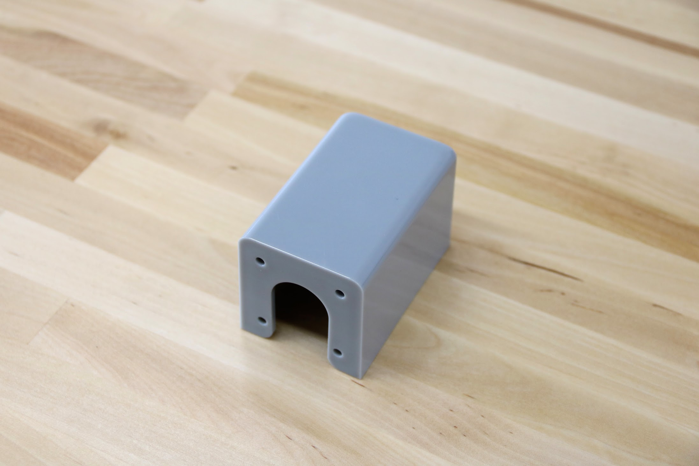
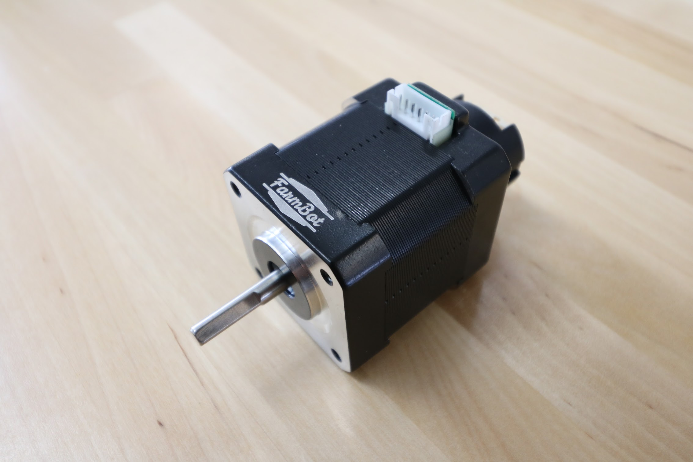

* toc
{:toc}

[part 1](#part-1)

[part 2](#part-2)

[part 3](#part-3)

# Part 1

Part 1 is a very important part. Without it, FarmBot might not work correctly.

|                              |                              |
|------------------------------|------------------------------|
|**Material**                  |Gray UV stabilized ABS
|**Price**                     |$7.50
|**Quantity**                  |3
|**Recommended Supplier**      |[The FarmBot Shop](http://shop.farm.bot)

**Internal specs**{:.internal}

|                              |                              |
|------------------------------|------------------------------|
|**Internal Part Name**        |`75mm Part 1 Gray Rev A`
|**Vendor**                    |Factory 1
|**$/pc**                      |$2.50
|**Component Tests**           |[Plastic Part Tests](/)
|**Notes**                     |Cannot have ejector pin artifacts
{:.internal}

# Part 2

Part 2 is not that important. You can lose it in the grass and be okay. JK!

# Part 3
